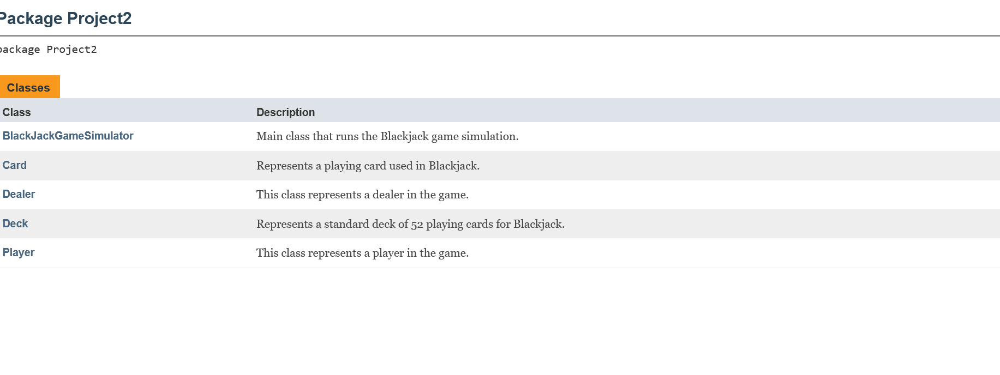
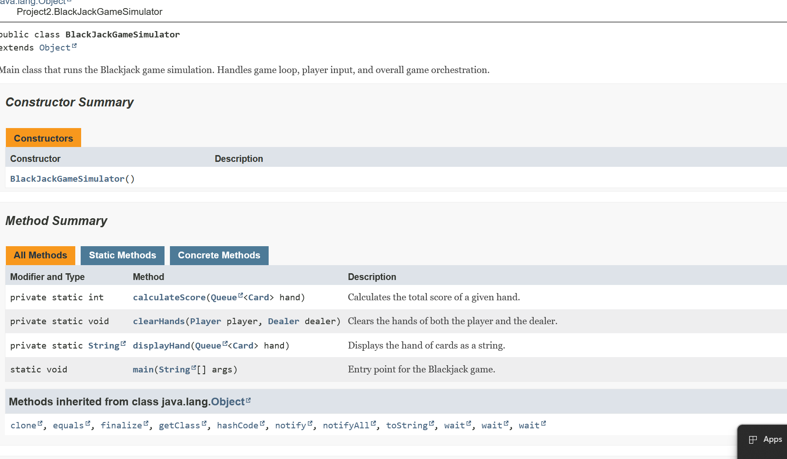

# Mini Project Two

## Design 

For the black jack project, there are a relatively few number of design choices that are ultimately left to the designer. From the project spec, we know that we have to create a black jack game with one dealer and one player, with the dealer having a single concealed cards and an automated set of behaviors to play against. Likewise, we can assume that their is only one standard playing card deck with 52 cards, with four suits, and a->k for each card type. 

The decisions we get to make come down in smaller things, like the structures we use for shuffling, storing the deck, frequency of shuffling, the amount of money the player starts off with, the maximum amount of money they are able to accumulate before the pit boss gets suspicious and throws them out, and the interface the user has to the program to see what the dealer has and what they have. 

So, getting into the nitty gritty of it here's my throughts on a design: 

1. We need a player component, a dealer component, a card component, a deck component, and a game component, which is where everything runs.
2. We need an entry method to the game component, which will be some I/O that allows for player decision
3. We need to make a decision on how much money to give the player. That could be initialized as a cli, but I am partial to not doing so to reduce potential error, so I'll decide to give everyone 100$ USD in tokens and assume they can bet in 1$ increments, with a minimum bet of 1$, with no maximum bet. I also said the earlier thing about the pit boss as a joke
4. As far as the deck construction goes, the deck will be a stack of card object types. When we draw, i don't realy want to worry about deallocating memory and reallocating memory, so I just will keep everything in scope and use a top of deck pointer. 
5. As far as reshuffling goes, I'm just going to re-shuffle after every 4 hands to make the odds stay relatively consistent. In a classic black jack game, you'd use a shoe of a number of different decks put together, so I figure this will be a good way to approach it 
6. I also forgot when designing, in the case of a tie bets should be pushed. 

## Implementation 

``` java
package Project2;

import java.util.Scanner;
import java.util.Queue;

/**
 * Main class that runs the Blackjack game simulation.
 * Handles game loop, player input, and overall game orchestration.
 * 
 * @author Duncan Parke
 * @version 1.0
 */
public class BlackJackGameSimulator {

    /**
     * Entry point for the Blackjack game.
     * Handles game setup, user input, and round progression.
     * 
     * @param args Command line arguments (unused).
     * 
     */
    public static void main(String[] args) {
        Scanner scanner = new Scanner(System.in);
        System.out.println("Welcome to Blackjack!");

        System.out.print("Enter your name: ");
        String playerName = scanner.nextLine();
        Player player = new Player(playerName);
        Dealer dealer = new Dealer();
        Deck deck = new Deck();

        int handCount = 0;
        final int RESHUFFLE_AFTER = 4;

        boolean playing = true;

        while (playing) {
            System.out.println("\n--- New Hand ---");

            // Reshuffle deck if needed
            if (handCount % RESHUFFLE_AFTER == 0) {
                deck.shuffle();
                System.out.println("Deck reshuffled!");
            }

            handCount++;

            // Get Bet Amount from User
            System.out.print("Enter your bet amount (current balance: $" + player.getMoney() + "): ");
            int bet;
            while (true) {
                try {
                    bet = Integer.parseInt(scanner.nextLine());
                    if (bet <= 0 || bet > player.getMoney()) {
                        System.out.print("Invalid bet. Please enter a valid amount: ");
                    } else {
                        break;
                    }
                } catch (NumberFormatException e) {
                    System.out.print("Invalid input. Please enter a number: ");
                }
            }
            // Deduct bet from player's money   
            if (player.getMoney() < bet) {
                System.out.println("Not enough money to bet. Game over.");
                break;
            }
            player.takeMoney(bet);

            // Deal initial cards
            dealer.dealCard(player, deck.drawCard());
            dealer.dealCard(player, deck.drawCard());

            Card faceUpCard = deck.drawCard(); // face up
            dealer.getHand().add(faceUpCard);
            Card faceDownCard = deck.drawCard(); // face down
            dealer.getHand().add(faceDownCard);

            System.out.println(player.getName() + "'s hand: " + displayHand(player.getHand()));
            System.out.println("Dealer shows: " + faceUpCard);

            // Check for immediate Blackjack
            int playerScore = calculateScore(player.getHand());
            if (playerScore == 21) {
                System.out.println("Blackjack! You win!");
                player.giveMoney(bet * 2);
                clearHands(player, dealer);
                continue;
            }

            // Player turn
            boolean playerTurnOver = false;
            while (!playerTurnOver) {
                System.out.print("Hit or Stay? (h/s): ");
                String choice = scanner.nextLine();
                if (choice.equalsIgnoreCase("h")) {
                    dealer.dealCard(player, deck.drawCard());
                    System.out.println("Your hand: " + displayHand(player.getHand()));

                    playerScore = calculateScore(player.getHand());
                    if (playerScore > 21) {
                        System.out.println("Bust! You lose.");
                        playerTurnOver = true;
                    }
                } else if (choice.equalsIgnoreCase("s")) {
                    playerTurnOver = true;
                } else {
                    System.out.println("Invalid input. Please enter 'h' or 's'.");
                }
            }

            // Dealer turn
            if (playerScore <= 21) {
                System.out.println("Dealer's hidden card: " + faceDownCard);
                int dealerScore = calculateScore(dealer.getHand());
                while (dealerScore < 17) {
                    dealer.getHand().add(deck.drawCard());
                    dealerScore = calculateScore(dealer.getHand());
                }

                System.out.println("Dealer's hand: " + displayHand(dealer.getHand()));

                // Determine winner
                if (dealerScore > 21 || playerScore > dealerScore) {
                    System.out.println("You win!");
                    player.giveMoney(bet * 2);
                } else if (dealerScore == playerScore) {
                    System.out.println("Push! Bet returned.");
                    player.giveMoney(bet);
                } else {
                    System.out.println("Dealer wins.");
                }
            }

            clearHands(player, dealer);

            // Ask to continue
            System.out.print("Play another hand? (y/n): ");
            String response = scanner.nextLine();
            if (!response.equalsIgnoreCase("y")) {
                playing = false;
            }
        }

        System.out.println("Thanks for playing, " + player.getName() + "! You leave with $" + player.getMoney());
        scanner.close();
    }

    /**
     * Clears the hands of both the player and the dealer.
     * 
     * @param player The player whose hand is to be cleared.
     * @param dealer The dealer whose hand is to be cleared.
     */
    private static void clearHands(Player player, Dealer dealer) {
        player.discardHand();
        dealer.discardHand();
    }

    /**
     * Displays the hand of cards as a string.
     * 
     * @param hand The hand of cards to display.
     * @return A string representation of the hand.
     */
    private static String displayHand(Queue<Card> hand) {
        StringBuilder sb = new StringBuilder();
        for (Card card : hand) {
            sb.append(card.toString()).append(", ");
        }
        return sb.length() > 0 ? sb.substring(0, sb.length() - 2) : "Empty hand";
    }

    /**
     * Calculates the total score of a given hand.
     * Aces are counted as 11 unless it would bust the hand, then counted as 1.
     * 
     * @param hand The hand of cards to score.
     * @return The total point value of the hand.
     */
    private static int calculateScore(Queue<Card> hand) {
        int total = 0;
        int aces = 0;

        for (Card card : hand) {
            int value = card.getValue();
            if (card.getRank().equals("A")) {
                aces++;
                value = 11;
            }
            total += value;
        }

        // Downgrade Aces from 11 to 1 as needed
        while (total > 21 && aces > 0) {
            total -= 10;
            aces--;
        }

        return total;
    } // end of calculateScore method
} // end of BlackJackGameSimulator class


package Project2;

import java.util.LinkedList;
import java.util.Queue;

/**
 * This class represents a player in the game.
 * It contains properties for the player's name and hand of cards.
 * It also includes methods to get the player's name and hand.
 * @author Duncan Parke
 * @version 1.0
 */

public class Player {

    // Default constructor
    /**
     * Default constructor to create a player with no specific name.
     */
    public Player() {
        this.name = "Player";
        this.money = 100; // Default money amount
    }

    // Constructor
    /**
     * Constructor to create a player with a specific name.
     * @param name The name of the player.
     */
    public Player(String name) {
        this.name = name;
        this.money = 100; // Default money amount
    }    

    // Take card from dealer
    /**
     * Method to take a card from the dealer and add it to the player's hand.
     * @param card The card to add to the player's hand.
     */
    public void takeCard(Card card) {
        hand.add(card);
    }

    // Discard Hand at end of round
    /**
     * Method to discard the player's hand at the end of a round.
     */
    public void discardHand() {
        hand.clear();
    }

    // Function which takes money from the player
    /**
     * Method to take money from the player.
     * @param amount The amount of money to take.
     */
    public void takeMoney(int amount) {
        money -= amount;
    }
    // Function which gives money to the player
    /**
     * Method to give money to the player.
     * @param amount The amount of money to give.
     */
    public void giveMoney(int amount) {
        money += amount;
    }

    // Function which returns the amount of money the player has
    /**
     * Method to get the amount of money the player has.
     * @return The amount of money the player has.
     */
    public int getMoney() {
        return money;
    }
    // Getters
    /**
     * Gets the name of the player.
     * @return The name of the player.
     */
    public String getName() {
        return name;
    }
    /**
     * Gets the player's hand of cards.
     * @return The player's hand of cards.
     */
    public Queue<Card> getHand() {
        return hand;
    }

    // Class Members
    private String name;
    // Queue of Cards
    private Queue<Card> hand = new LinkedList<Card>();
    // Money 
    private int money;

} // End of Player class

package Project2;

import java.util.LinkedList;
import java.util.Queue;
/**
 * This class represents a dealer in the game.
 * It contains properties for the dealer's hand of cards.
 * It also includes methods to deal cards to players and manage the dealer's hand.
 * @author Duncan Parke
 * @version 1.0
 */
public class Dealer {

    // Constructor
    /**
     * Constructor to create a dealer.
     * The name is set to "Dealer" by default.
     */
    public Dealer() {
        this.hand = new LinkedList<>();
        this.name = "Dealer"; // Default name for the dealer
    }    

    // Deal card to player
    /**
     * Method to deal a card to a player or the dealer.
     * @param player The player to deal the card to. If null, the dealer takes the card.
     * @param card The card to deal.
     */
    public void dealCard(Player player, Card card) {
        if (player != null) {
            player.takeCard(card);
        } else {
            hand.add(card);
        }
    }

    // Discard Hand at end of round
    /**
     * Method to discard the dealer's hand at the end of a round.
     */
    public void discardHand() {
        hand.clear();
    }

    // Getters
    /**
     * Gets the dealer's hand.
     * @return The dealer's hand.
     */
    public Queue<Card> getHand() {
        return hand;
    }

    /**
     * Gets the dealer's name.
     * @return The dealer's name.
     */
    public String getName() {
        return name;
    }

    // Setters
    /**
     * Sets the dealer's hand.
     * @param hand The hand to set.
     */
    public void setHand(Queue<Card> hand) {
        this.hand = hand;
    }

    // Class Members
    private Queue<Card> hand; // The dealer's hand of cards
    private String name; // The dealer's name
    
} // end of Dealer class

package Project2;

import java.util.Collections;
import java.util.Stack;
import java.util.ArrayList;
import java.util.List;

/**
 * Represents a standard deck of 52 playing cards for Blackjack.
 * Provides functionality to shuffle and draw cards from the deck.
 * 
 * @author Duncan Parke
 * @version 1.0
 */
public class Deck {

    private Stack<Card> cards;
    private final String[] suits = { "Hearts", "Diamonds", "Clubs", "Spades" };
    private final String[] ranks = { "2", "3", "4", "5", "6", "7", "8", "9", "10", "J", "Q", "K", "A" };

    /**
     * Constructs and initializes the deck with 52 standard playing cards.
     */
    public Deck() {
        cards = new Stack<>();
        buildDeck();
        shuffle();
    }

    /**
     * Builds a new full deck of 52 cards.
     * Called during construction and reshuffle.
     */
    private void buildDeck() {
        cards.clear();
        for (String suit : suits) {
            for (String rank : ranks) {
                cards.push(new Card(rank, suit));
            }
        }
    }

    /**
     * Shuffles the current deck using Java's Collections utility.
     */
    public void shuffle() {
        List<Card> temp = new ArrayList<>(cards);
        Collections.shuffle(temp);
        cards = new Stack<>();
        cards.addAll(temp);
    }

    /**
     * Draws the top card from the deck.
     * If the deck is empty, rebuilds and reshuffles before drawing.
     * 
     * @return The top card from the deck.
     */
    public Card drawCard() {
        if (cards.isEmpty()) {
            System.out.println("Deck is empty. Rebuilding and reshuffling...");
            buildDeck();
            shuffle();
        }
        return cards.pop();
    }

    /**
     * Gets the number of remaining cards in the deck.
     * 
     * @return Number of cards left in the deck.
     */
    public int cardsRemaining() {
        return cards.size();
    }
} // end of Deck class

package Project2;

/**
 * Represents a playing card used in Blackjack.
 * Contains rank, suit, and value information.
 * Face cards (J, Q, K) have a value of 10.
 * Ace (A) has a default value of 1 (can be treated as 11 in hand calculation).
 * 
 * @author Duncan Parke
 * @version 1.0
 */
public class Card {

    /**
     * Constructs a new card with the given rank and suit.
     * Automatically sets the Blackjack value.
     * 
     * @param rank The rank of the card (2-10, J, Q, K, A).
     * @param suit The suit of the card (Hearts, Diamonds, Clubs, Spades).
     */
    public Card(String rank, String suit) {
        this.rank = rank;
        this.suit = suit;
        this.value = determineValue(rank);
    }

    /**
     * Determines the Blackjack value of a card based on its rank.
     * 
     * @param rank The rank of the card.
     * @return The Blackjack value.
     */
    private int determineValue(String rank) {
        switch (rank) {
            case "J":
            case "Q":
            case "K":
                return 10;
            case "A":
                return 1; // Will be treated as 11 in hand calculation if appropriate
            default:
                return Integer.parseInt(rank);
        }
    }

    /**
     * Gets the card's rank.
     * @return The card's rank.
     */
    public String getRank() {
        return rank;
    }

    /**
     * Gets the card's suit.
     * @return The card's suit.
     */
    public String getSuit() {
        return suit;
    }

    /**
     * Gets the card's value in Blackjack.
     * @return The card's value.
     */
    public int getValue() {
        return value;
    }

    /**
     * Returns a string representation of the card.
     * @return A string in the format "Rank of Suit", e.g., "A of Hearts".
     */
    @Override
    public String toString() {
        return rank + " of " + suit;
    }

    // Class Members
    private String rank;
    private String suit;
    private int value;

} // end of Card class

```
## Output 
```
Script started on 2025-04-06 23:25:20-04:00 [TERM="xterm-256color" TTY="/dev/pts/5" COLUMNS="138" LINES="13"]
[?2004h]0;arkosh@Mjolnir: ~/dev/605_201arkosh@Mjolnir:~/dev/605_201$ ^C[?2004l
[?2004h
[?2004l

[?2004h]0;arkosh@Mjolnir: ~/dev/605_201arkosh@Mjolnir:~/dev/605_201$  cd /home/arkosh/dev/605_201 ; /usr/bin/env /usr/lib/jvm/java-21-openjdk-amd64/bin/java -XX:+ShowCodeDetailsInExceptionMessages -cp /home/arkosh/.vscode-server/data/User/workspaceStorage/c10569d5ef0ee75b2280be6f131d5434/redhat.java/jdt_ws/605_201_1aef2a31/bin Project2.BlackJackGameSimulator 
[?2004l
Welcome to Blackjack!
Enter your name: Player

--- New Hand ---
Deck reshuffled!
Enter your bet amount (current balance: $100): 5
Player's hand: 5 of Diamonds, J of Hearts
Dealer shows: 3 of Diamonds
Hit or Stay? (h/s): h
Your hand: 5 of Diamonds, J of Hearts, 5 of Hearts
Hit or Stay? (h/s): s
Dealer's hidden card: 5 of Spades
Dealer's hand: 3 of Diamonds, 5 of Spades, 8 of Clubs, A of Hearts
You win!
Play another hand? (y/n): y

--- New Hand ---
Enter your bet amount (current balance: $105): 100   120  
Invalid bet. Please enter a valid amount: 1000
Invalid bet. Please enter a valid amount: 105
Player's hand: 3 of Hearts, 10 of Spades
Dealer shows: 9 of Hearts
Hit or Stay? (h/s): h
Your hand: 3 of Hearts, 10 of Spades, 6 of Hearts
Hit or Stay? (h/s): s
Dealer's hidden card: 2 of Spades
Dealer's hand: 9 of Hearts, 2 of Spades, K of Clubs
Dealer wins.
You are out of money! Game over.
Thanks for playing, Player! You leave with $0
[?2004h]0;arkosh@Mjolnir: ~/dev/605_201arkosh@Mjolnir:~/dev/605_201$ ^C[?2004l
[?2004h
[?2004l

[?2004h]0;arkosh@Mjolnir: ~/dev/605_201arkosh@Mjolnir:~/dev/605_201$  cd /home/arkosh/dev/605_201 ; /usr/bin/env /usr/lib/jvm/java-21-openjdk-amd64/bin/java -XX:+ShowCodeDetailsInExceptionMessages -cp /home/arkosh/.vscode-server/data/User/workspaceStorage/c10569d5ef0ee75b2280be6f131d5434/redhat.java/jdt_ws/605_201_1aef2a31/bin Project2.BlackJackGameSimulator 
[?2004l
Welcome to Blackjack!
Enter your name: DUnc    Player

--- New Hand ---
Deck reshuffled!
Enter your bet amount (current balance: $100): 4 5
Player's hand: 7 of Diamonds, 8 of Diamonds
Dealer shows: 6 of Diamonds
Hit or Stay? (h/s): h
Your hand: 7 of Diamonds, 8 of Diamonds, 6 of Hearts
Hit or Stay? (h/s): s
Dealer's hidden card: 4 of Hearts
Dealer's hand: 6 of Diamonds, 4 of Hearts, A of Spades
Push! Bet returned.
Play another hand? (y/n): n
Thanks for playing, Player! You leave with $100
[?2004h]0;arkosh@Mjolnir: ~/dev/605_201arkosh@Mjolnir:~/dev/605_201$ exit
[?2004l
exit

Script done on 2025-04-06 23:27:55-04:00 [COMMAND_EXIT_CODE="0"]

```

## Java Doc Stuff



