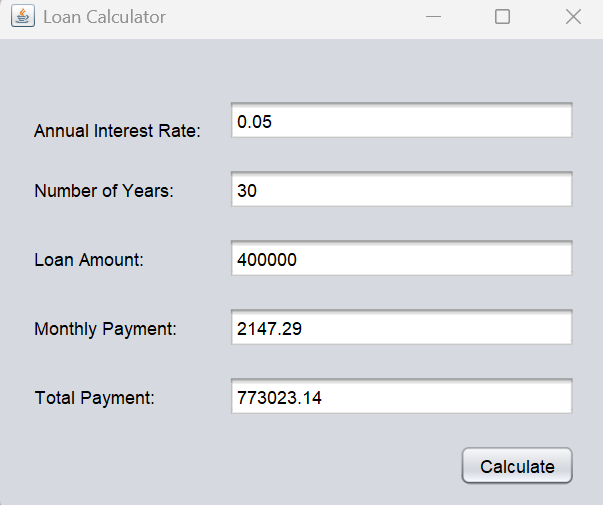

# Mini Project Three

## Design 

There was very little to design. I used netbeans to mirror the GUI layout from the sheet, and all back end code was a matter of how variables were assigned and in what order, but else its just implementing the functions as given to us on click of calculate. 

## Implementation

``` java
/*
 * Click nbfs://nbhost/SystemFileSystem/Templates/Licenses/license-default.txt to change this license
 * Click nbfs://nbhost/SystemFileSystem/Templates/GUIForms/JFrame.java to edit this template
 */

/**
 *
 * @author dunca
 */
public class LoanCalculator extends javax.swing.JFrame {

    /**
     * Creates new form LoanCalculator
     */
    public LoanCalculator() {
        initComponents();
    }

    /**
     * This method is called from within the constructor to initialize the form.
     * WARNING: Do NOT modify this code. The content of this method is always
     * regenerated by the Form Editor.
     */
    @SuppressWarnings("unchecked")
    // <editor-fold defaultstate="collapsed" desc="Generated Code">                          
    private void initComponents() {

        AnnualInterestRateLabel = new javax.swing.JLabel();
        NumberOfYearsLabel = new javax.swing.JLabel();
        LoanAmountLabel = new javax.swing.JLabel();
        MonthlyPaymentLabel = new javax.swing.JLabel();
        TotalPaymentLabel = new javax.swing.JLabel();
        AnnualInterestRate = new javax.swing.JTextField();
        NumberOfYears = new javax.swing.JTextField();
        LoanAmount = new javax.swing.JTextField();
        MonthlyPayment = new javax.swing.JTextField();
        TotalPayment = new javax.swing.JTextField();
        Calculate = new javax.swing.JButton();

        setDefaultCloseOperation(javax.swing.WindowConstants.EXIT_ON_CLOSE);
        setTitle("Loan Calculator");

        AnnualInterestRateLabel.setText("Annual Interest Rate:");

        NumberOfYearsLabel.setText("Number of Years:");

        LoanAmountLabel.setText("Loan Amount:");

        MonthlyPaymentLabel.setText("Monthly Payment:");

        TotalPaymentLabel.setText("Total Payment:");

        AnnualInterestRate.addActionListener(new java.awt.event.ActionListener() {
            public void actionPerformed(java.awt.event.ActionEvent evt) {
                AnnualInterestRateActionPerformed(evt);
            }
        });

        LoanAmount.addActionListener(new java.awt.event.ActionListener() {
            public void actionPerformed(java.awt.event.ActionEvent evt) {
                LoanAmountActionPerformed(evt);
            }
        });

        MonthlyPayment.addActionListener(new java.awt.event.ActionListener() {
            public void actionPerformed(java.awt.event.ActionEvent evt) {
                MonthlyPaymentActionPerformed(evt);
            }
        });

        TotalPayment.addActionListener(new java.awt.event.ActionListener() {
            public void actionPerformed(java.awt.event.ActionEvent evt) {
                TotalPaymentActionPerformed(evt);
            }
        });

        Calculate.setText("Calculate");
        Calculate.addActionListener(new java.awt.event.ActionListener() {
            public void actionPerformed(java.awt.event.ActionEvent evt) {
                CalculateActionPerformed(evt);
            }
        });

        javax.swing.GroupLayout layout = new javax.swing.GroupLayout(getContentPane());
        getContentPane().setLayout(layout);
        layout.setHorizontalGroup(
            layout.createParallelGroup(javax.swing.GroupLayout.Alignment.LEADING)
            .addGroup(layout.createSequentialGroup()
                .addGap(23, 23, 23)
                .addGroup(layout.createParallelGroup(javax.swing.GroupLayout.Alignment.TRAILING)
                    .addComponent(Calculate)
                    .addGroup(layout.createSequentialGroup()
                        .addGroup(layout.createParallelGroup(javax.swing.GroupLayout.Alignment.LEADING)
                            .addGroup(layout.createParallelGroup(javax.swing.GroupLayout.Alignment.LEADING, false)
                                .addComponent(AnnualInterestRateLabel, javax.swing.GroupLayout.DEFAULT_SIZE, javax.swing.GroupLayout.DEFAULT_SIZE, Short.MAX_VALUE)
                                .addComponent(NumberOfYearsLabel, javax.swing.GroupLayout.DEFAULT_SIZE, javax.swing.GroupLayout.DEFAULT_SIZE, Short.MAX_VALUE))
                            .addComponent(LoanAmountLabel)
                            .addComponent(MonthlyPaymentLabel)
                            .addComponent(TotalPaymentLabel))
                        .addGap(18, 18, 18)
                        .addGroup(layout.createParallelGroup(javax.swing.GroupLayout.Alignment.LEADING, false)
                            .addComponent(NumberOfYears)
                            .addComponent(AnnualInterestRate)
                            .addComponent(LoanAmount)
                            .addComponent(MonthlyPayment)
                            .addComponent(TotalPayment, javax.swing.GroupLayout.DEFAULT_SIZE, 232, Short.MAX_VALUE))))
                .addContainerGap(22, Short.MAX_VALUE))
        );
        layout.setVerticalGroup(
            layout.createParallelGroup(javax.swing.GroupLayout.Alignment.LEADING)
            .addGroup(layout.createSequentialGroup()
                .addGap(40, 40, 40)
                .addGroup(layout.createParallelGroup(javax.swing.GroupLayout.Alignment.TRAILING)
                    .addComponent(AnnualInterestRateLabel)
                    .addComponent(AnnualInterestRate, javax.swing.GroupLayout.PREFERRED_SIZE, javax.swing.GroupLayout.DEFAULT_SIZE, javax.swing.GroupLayout.PREFERRED_SIZE))
                .addGap(18, 18, 18)
                .addGroup(layout.createParallelGroup(javax.swing.GroupLayout.Alignment.BASELINE)
                    .addComponent(NumberOfYearsLabel)
                    .addComponent(NumberOfYears, javax.swing.GroupLayout.PREFERRED_SIZE, javax.swing.GroupLayout.DEFAULT_SIZE, javax.swing.GroupLayout.PREFERRED_SIZE))
                .addGap(18, 18, 18)
                .addGroup(layout.createParallelGroup(javax.swing.GroupLayout.Alignment.BASELINE)
                    .addComponent(LoanAmountLabel)
                    .addComponent(LoanAmount, javax.swing.GroupLayout.PREFERRED_SIZE, javax.swing.GroupLayout.DEFAULT_SIZE, javax.swing.GroupLayout.PREFERRED_SIZE))
                .addGap(18, 18, 18)
                .addGroup(layout.createParallelGroup(javax.swing.GroupLayout.Alignment.BASELINE)
                    .addComponent(MonthlyPaymentLabel)
                    .addComponent(MonthlyPayment, javax.swing.GroupLayout.PREFERRED_SIZE, javax.swing.GroupLayout.DEFAULT_SIZE, javax.swing.GroupLayout.PREFERRED_SIZE))
                .addGap(18, 18, 18)
                .addGroup(layout.createParallelGroup(javax.swing.GroupLayout.Alignment.BASELINE)
                    .addComponent(TotalPaymentLabel)
                    .addComponent(TotalPayment, javax.swing.GroupLayout.PREFERRED_SIZE, javax.swing.GroupLayout.DEFAULT_SIZE, javax.swing.GroupLayout.PREFERRED_SIZE))
                .addGap(18, 18, 18)
                .addComponent(Calculate)
                .addContainerGap(17, Short.MAX_VALUE))
        );

        pack();
    }// </editor-fold>                        

    private void AnnualInterestRateActionPerformed(java.awt.event.ActionEvent evt) {                                                   
        // TODO add your handling code here:
    }                                                  

    private void LoanAmountActionPerformed(java.awt.event.ActionEvent evt) {                                           
        // TODO add your handling code here:
    }                                          

    private void MonthlyPaymentActionPerformed(java.awt.event.ActionEvent evt) {                                               
        // TODO add your handling code here:
    }                                              

    private void TotalPaymentActionPerformed(java.awt.event.ActionEvent evt) {                                             
        // TODO add your handling code here:
    }                                            

    private void CalculateActionPerformed(java.awt.event.ActionEvent evt) {                                          
        double interest = Double.parseDouble(AnnualInterestRate.getText());
        double loan_amount = Double.parseDouble(LoanAmount.getText());
        double num_years = Double.parseDouble(NumberOfYears.getText());
        double monthly_interest = interest/12; 
        double monthly_payment = 
            (monthly_interest * loan_amount)/(1-(Math.pow(1 +monthly_interest,
                -(12 * num_years))));
        MonthlyPayment.setText(String.format("%.2f",monthly_payment));
        double total_payment = monthly_payment * num_years * 12;
        TotalPayment.setText(String.format("%.2f",total_payment));
        
    }                                         

    /**
     * @param args the command line arguments
     */
    public static void main(String args[]) {
        /* Set the Nimbus look and feel */
        //<editor-fold defaultstate="collapsed" desc=" Look and feel setting code (optional) ">
        /* If Nimbus (introduced in Java SE 6) is not available, stay with the default look and feel.
         * For details see http://download.oracle.com/javase/tutorial/uiswing/lookandfeel/plaf.html 
         */
        try {
            for (javax.swing.UIManager.LookAndFeelInfo info : javax.swing.UIManager.getInstalledLookAndFeels()) {
                if ("Nimbus".equals(info.getName())) {
                    javax.swing.UIManager.setLookAndFeel(info.getClassName());
                    break;
                }
            }
        } catch (ClassNotFoundException ex) {
            java.util.logging.Logger.getLogger(LoanCalculator.class.getName()).log(java.util.logging.Level.SEVERE, null, ex);
        } catch (InstantiationException ex) {
            java.util.logging.Logger.getLogger(LoanCalculator.class.getName()).log(java.util.logging.Level.SEVERE, null, ex);
        } catch (IllegalAccessException ex) {
            java.util.logging.Logger.getLogger(LoanCalculator.class.getName()).log(java.util.logging.Level.SEVERE, null, ex);
        } catch (javax.swing.UnsupportedLookAndFeelException ex) {
            java.util.logging.Logger.getLogger(LoanCalculator.class.getName()).log(java.util.logging.Level.SEVERE, null, ex);
        }
        //</editor-fold>

        /* Create and display the form */
        java.awt.EventQueue.invokeLater(new Runnable() {
            public void run() {
                new LoanCalculator().setVisible(true);
            }
        });
    } // end main()

    // Variables declaration - do not modify                     
    private javax.swing.JTextField AnnualInterestRate;
    private javax.swing.JLabel AnnualInterestRateLabel;
    private javax.swing.JButton Calculate;
    private javax.swing.JTextField LoanAmount;
    private javax.swing.JLabel LoanAmountLabel;
    private javax.swing.JTextField MonthlyPayment;
    private javax.swing.JLabel MonthlyPaymentLabel;
    private javax.swing.JTextField NumberOfYears;
    private javax.swing.JLabel NumberOfYearsLabel;
    private javax.swing.JTextField TotalPayment;
    private javax.swing.JLabel TotalPaymentLabel;
    // End of variables declaration                   
} 


```
## Output


