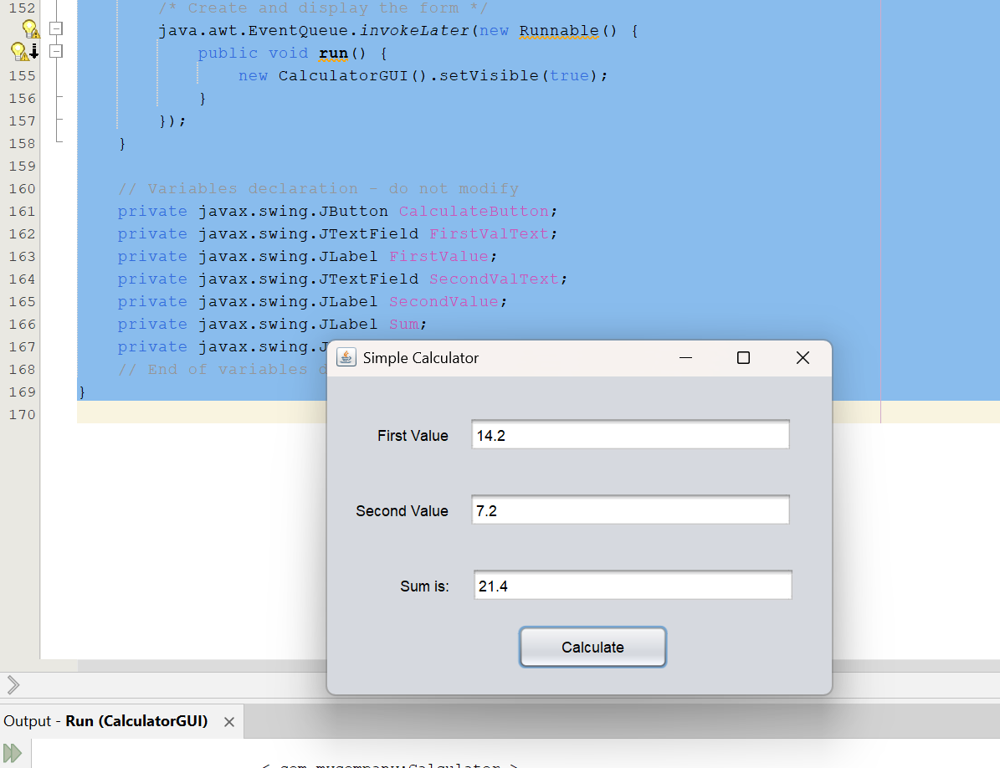

# Module Thirteen - Assignment Submission

## The Assignment

> This assignment involves building a
> simple calculator using Java Swing. The
> calculator shall allow the user to enter
> two values and then calculate their sum
> when the user clicks on the Calculate
> button. The GUI should look similar to the
> one below. You can left justify, center, or
> right justify the calculate button

## Design

Again, there's really no design. You just replicate what is shown. I am assuming double representation of the numbers

## Implementation

``` java

/*
 * Click nbfs://nbhost/SystemFileSystem/Templates/Licenses/license-default.txt to change this license
 * Click nbfs://nbhost/SystemFileSystem/Templates/GUIForms/JFrame.java to edit this template
 */

/**
 *
 * @author dunca
 */
public class CalculatorGUI extends javax.swing.JFrame {

    /**
     * Creates new form CalculatorGUI
     */
    public CalculatorGUI() {
        initComponents();
    }

    /**
     * This method is called from within the constructor to initialize the form.
     * WARNING: Do NOT modify this code. The content of this method is always
     * regenerated by the Form Editor.
     */
    @SuppressWarnings("unchecked")
    // <editor-fold defaultstate="collapsed" desc="Generated Code">                          
    private void initComponents() {

        FirstValue = new javax.swing.JLabel();
        FirstValText = new javax.swing.JTextField();
        SecondValText = new javax.swing.JTextField();
        SecondValue = new javax.swing.JLabel();
        SumText = new javax.swing.JTextField();
        Sum = new javax.swing.JLabel();
        CalculateButton = new javax.swing.JButton();

        setDefaultCloseOperation(javax.swing.WindowConstants.EXIT_ON_CLOSE);
        setTitle("Simple Calculator");

        FirstValue.setText("First Value");

        SecondValText.addActionListener(new java.awt.event.ActionListener() {
            public void actionPerformed(java.awt.event.ActionEvent evt) {
                SecondValTextActionPerformed(evt);
            }
        });

        SecondValue.setText("Second Value");

        SumText.addActionListener(new java.awt.event.ActionListener() {
            public void actionPerformed(java.awt.event.ActionEvent evt) {
                SumTextActionPerformed(evt);
            }
        });

        Sum.setText("Sum is:");

        CalculateButton.setText("Calculate");
        CalculateButton.addActionListener(new java.awt.event.ActionListener() {
            public void actionPerformed(java.awt.event.ActionEvent evt) {
                CalculateButtonActionPerformed(evt);
            }
        });

        javax.swing.GroupLayout layout = new javax.swing.GroupLayout(getContentPane());
        getContentPane().setLayout(layout);
        layout.setHorizontalGroup(
            layout.createParallelGroup(javax.swing.GroupLayout.Alignment.LEADING)
            .addGroup(layout.createSequentialGroup()
                .addGroup(layout.createParallelGroup(javax.swing.GroupLayout.Alignment.LEADING)
                    .addGroup(layout.createSequentialGroup()
                        .addGap(23, 23, 23)
                        .addGroup(layout.createParallelGroup(javax.swing.GroupLayout.Alignment.LEADING)
                            .addComponent(SecondValue, javax.swing.GroupLayout.Alignment.TRAILING)
                            .addComponent(Sum, javax.swing.GroupLayout.Alignment.TRAILING)
                            .addComponent(FirstValue, javax.swing.GroupLayout.Alignment.TRAILING))
                        .addGap(18, 18, 18)
                        .addGroup(layout.createParallelGroup(javax.swing.GroupLayout.Alignment.LEADING)
                            .addComponent(SumText, javax.swing.GroupLayout.PREFERRED_SIZE, 258, javax.swing.GroupLayout.PREFERRED_SIZE)
                            .addGroup(javax.swing.GroupLayout.Alignment.TRAILING, layout.createSequentialGroup()
                                .addComponent(CalculateButton, javax.swing.GroupLayout.PREFERRED_SIZE, 120, javax.swing.GroupLayout.PREFERRED_SIZE)
                                .addGap(101, 101, 101))))
                    .addGroup(javax.swing.GroupLayout.Alignment.CENTER, layout.createSequentialGroup()
                        .addGap(112, 112, 112)
                        .addGroup(layout.createParallelGroup(javax.swing.GroupLayout.Alignment.LEADING)
                            .addComponent(SecondValText, javax.swing.GroupLayout.Alignment.CENTER, javax.swing.GroupLayout.PREFERRED_SIZE, 258, javax.swing.GroupLayout.PREFERRED_SIZE)
                            .addComponent(FirstValText, javax.swing.GroupLayout.Alignment.CENTER, javax.swing.GroupLayout.PREFERRED_SIZE, 258, javax.swing.GroupLayout.PREFERRED_SIZE))))
                .addContainerGap(30, Short.MAX_VALUE))
        );
        layout.setVerticalGroup(
            layout.createParallelGroup(javax.swing.GroupLayout.Alignment.LEADING)
            .addGroup(layout.createSequentialGroup()
                .addGap(32, 32, 32)
                .addGroup(layout.createParallelGroup(javax.swing.GroupLayout.Alignment.BASELINE)
                    .addComponent(FirstValue)
                    .addComponent(FirstValText, javax.swing.GroupLayout.PREFERRED_SIZE, javax.swing.GroupLayout.DEFAULT_SIZE, javax.swing.GroupLayout.PREFERRED_SIZE))
                .addGap(32, 32, 32)
                .addGroup(layout.createParallelGroup(javax.swing.GroupLayout.Alignment.BASELINE)
                    .addComponent(SecondValue)
                    .addComponent(SecondValText, javax.swing.GroupLayout.PREFERRED_SIZE, javax.swing.GroupLayout.DEFAULT_SIZE, javax.swing.GroupLayout.PREFERRED_SIZE))
                .addGap(32, 32, 32)
                .addGroup(layout.createParallelGroup(javax.swing.GroupLayout.Alignment.BASELINE)
                    .addComponent(Sum)
                    .addComponent(SumText, javax.swing.GroupLayout.PREFERRED_SIZE, javax.swing.GroupLayout.DEFAULT_SIZE, javax.swing.GroupLayout.PREFERRED_SIZE))
                .addGap(18, 18, 18)
                .addComponent(CalculateButton, javax.swing.GroupLayout.PREFERRED_SIZE, 35, javax.swing.GroupLayout.PREFERRED_SIZE)
                .addContainerGap(21, Short.MAX_VALUE))
        );

        pack();
    }// </editor-fold>                        

    private void CalculateButtonActionPerformed(java.awt.event.ActionEvent evt) {                                                
        double sum = Double.parseDouble(FirstValText.getText()) + Double.parseDouble(SecondValText.getText());
        SumText.setText(String.valueOf(sum));
    }                                              

    private void SecondValTextActionPerformed(java.awt.event.ActionEvent evt) {                                              
        // TODO add your handling code here:
    }                                            

    private void SumTextActionPerformed(java.awt.event.ActionEvent evt) {                                        
        // TODO add your handling code here:
    }                                      

    /**
     * @param args the command line arguments
     */
    public static void main(String args[]) {
        /* Set the Nimbus look and feel */
        //<editor-fold defaultstate="collapsed" desc=" Look and feel setting code (optional) ">
        /* If Nimbus (introduced in Java SE 6) is not available, stay with the default look and feel.
         * For details see http://download.oracle.com/javase/tutorial/uiswing/lookandfeel/plaf.html
         */
        try {
            for (javax.swing.UIManager.LookAndFeelInfo info : javax.swing.UIManager.getInstalledLookAndFeels()) {
                if ("Nimbus".equals(info.getName())) {
                    javax.swing.UIManager.setLookAndFeel(info.getClassName());
                    break;
                }
            }
        } catch (ClassNotFoundException ex) {
            java.util.logging.Logger.getLogger(CalculatorGUI.class.getName()).log(java.util.logging.Level.SEVERE, null, ex);
        } catch (InstantiationException ex) {
            java.util.logging.Logger.getLogger(CalculatorGUI.class.getName()).log(java.util.logging.Level.SEVERE, null, ex);
        } catch (IllegalAccessException ex) {
            java.util.logging.Logger.getLogger(CalculatorGUI.class.getName()).log(java.util.logging.Level.SEVERE, null, ex);
        } catch (javax.swing.UnsupportedLookAndFeelException ex) {
            java.util.logging.Logger.getLogger(CalculatorGUI.class.getName()).log(java.util.logging.Level.SEVERE, null, ex);
        }
        //</editor-fold>

        /* Create and display the form */
        java.awt.EventQueue.invokeLater(new Runnable() {
            public void run() {
                new CalculatorGUI().setVisible(true);
            }
        });
    }

    // Variables declaration - do not modify                    
    private javax.swing.JButton CalculateButton;
    private javax.swing.JTextField FirstValText;
    private javax.swing.JLabel FirstValue;
    private javax.swing.JTextField SecondValText;
    private javax.swing.JLabel SecondValue;
    private javax.swing.JLabel Sum;
    private javax.swing.JTextField SumText;
    // End of variables declaration                  
}

```

## Output

