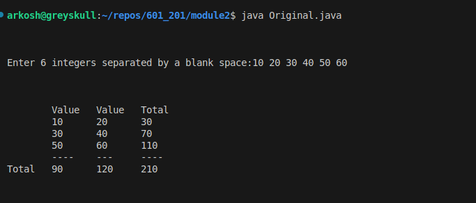
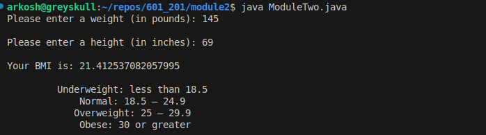

# Module Two - Assignment Submission

## The Assignment

This assignment tasks the programmer with two tasks:

1. Modify a preexisting .java source file to change the information that is displayed by the program to the specifications provided by a given screenshot 
2. Write a program which calculates a user's BMI from inputted data, and displays it to the user

## Design

### Modifying Original.java

To complete the necessary modifications for Original.java, we need to do a few things

1. Calculate the sum of the various rows and columns into variables
2. Add additional print statements to the code to display the values desired.

To calculate the sum of the rows and columns, addition operators can be use inside of print statements to reference the values in line.

### BMI Calculator

The BMI calculator program is similar in nature to the Original program. However, because we are required to work with conversion rates which are
non-integer, we need to introduce the use of mantissa style variables. Because of the length of the pound per kg variable, I believe double types
are necessary.

The general program flow will operate something like this:

1. Initialize our constant conversion factors and declare our variable inputs
2. Prompt the user for height and weight in imperial units
3. Convert the height and weight in imperial units to metric
4. Print out the BMI as a function of the metric heights and weights to the user
5. Print out the information about the BMI from DHHS for the user. 
6. End the program.

## Implementation

### Original.java

```
package test;

import java.util.Scanner;

// Class which inputs and outputs some ints
public class Original
{
   public static void main(String[] args)
   {
      // Define and initialize variables for values to be input
      int v1 = 0; // First value to be input
      int v2 = 0; // Second value to be input
      int v3 = 0; // Third value to be input
      int v4 = 0; // Fourth value to be input
      int v5 = 0; // Fifth value to be input
      int v6 = 0; // Sixth value to be input

      // Use a Scanner to input integer values
      Scanner input = new Scanner(System.in);
      System.out.println("\n\n");
      System.out.print("Enter 6 integers separated by a blank space:");
      v1 = input.nextInt(); // Input first value
      v2 = input.nextInt(); // Input second value
      v3 = input.nextInt(); // Input third value
      v4 = input.nextInt(); // Input fourth value
      v5 = input.nextInt(); // Input fifth value
      v6 = input.nextInt(); // Input sixth value

      // Output using System.out.println()
      // Instead of using variables for the addition, instead just 
      // do addition in line
      System.out.println("\n\n");
      System.out.println("\t" + "Value" + "\t" + "Value" 
         + "\t" + "Total");
      System.out.println("\t" + v1 + "\t" + v2 + "\t" + (v1+v2));
      System.out.println("\t" + v3 + "\t" + v4 + "\t" + (v3+v4));
      System.out.println("\t" + v5 + "\t" + v6 + "\t" + (v5+v6));
      System.out.println("\t----\t---\t----" ); 
      System.out.println("Total\t" + (v1+v3+v5) + "\t" +(v2+v4+v6) 
         + "\t" + (v1+v2+v3+v4+v5+v6));
      System.out.println("\n\n");
   } // end main()
} //  end class Original
```

### BMI Program

```
/** 
 * Assignment Two
 * 
 * This program takes in height and weight in inches and pounds to calculate BMI and return it
 * 
 * @author: Duncan Parke
 */
package test;

import java.util.Scanner;

// Class which takes in height and weight, and outputs BMI 
public class ModuleTwo 
{ 
    /*
     * Program Entry Point
     */
    public static void main(String[] args)
   {
        // Declare and Initialize Collected Vars
        int height = 0; // in inches
        int weight = 0; // in lbs 
        double metricWeight, metricHeight;
        
        // Declare and Initialize Consts
        // Over declared to not worry about 
        final double KGPLBS = 0.45359237; 
        final double MPIN = 0.0254; 
 
        // Use Scanner to get vars from user
        Scanner input = new Scanner(System.in); 
        System.out.print("Please enter a weight (in pounds): ");
        weight = input.nextInt(); // Get weight 
        System.out.print("\nPlease enter a height (in inches): "); 
        height = input.nextInt(); // Get height 

        // Calculate BMI 
        metricWeight = weight * KGPLBS; 
        metricHeight = height * MPIN; 

        // Report BMI to user 
        System.out.println(""); 
        System.out.println("Your BMI is: " 
            + metricWeight/(metricHeight * metricHeight)); 

        // Report DHHS / NIH stuff
        System.out.println("");
        System.out.println("\t Underweight: less than 18.5");
        System.out.println("\t     Normal: 18.5 – 24.9");
        System.out.println("\t    Overweight: 25 – 29.9");
        System.out.println("\t     Obese: 30 or greater");
        System.out.println(""); 
   } // end main()
} // end ModuleTwo
```

## Output from Execution

Original:



